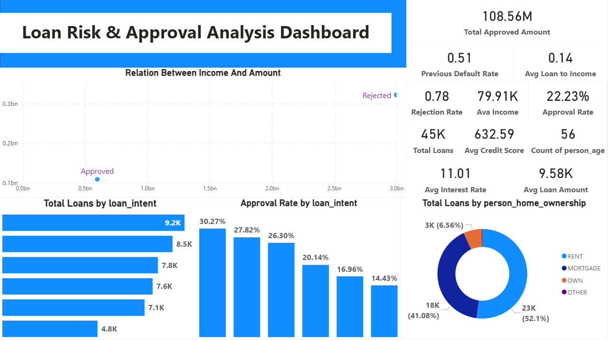
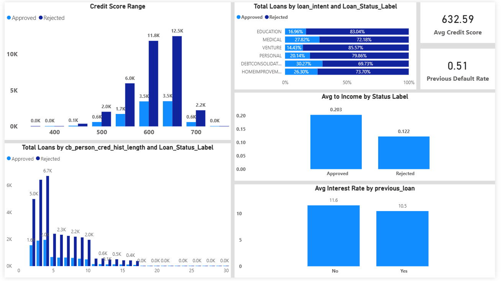
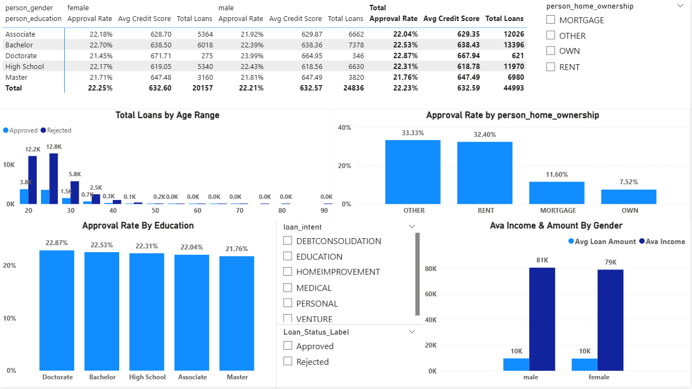

# 📊 Loan Risk & Approval Analysis Dashboard

تحليل بيانات احترافي لمجموعة قروض (Loan Dataset) باستخدام **Power BI**، بهدف فهم أنماط الموافقة والرفض على القروض، وتقييم المخاطر الائتمانية للعملاء بناءً على بياناتهم الديموغرافية والمالية.

---

## 📸 لقطات من الداشبورد

### 1️⃣ نظرة عامة (Overview)


### 2️⃣ تحليل المخاطر (Risk Analysis)


### 3️⃣ التحليل الديموغرافي (Demographics)


---

## 🧾 نظرة عامة على المشروع

- **حجم البيانات:** أكثر من 45,000 صف
- **المجال:** التحليل المالي / تقييم المخاطر الائتمانية (Credit Risk)
- **الأداة:** Microsoft Power BI Desktop
- **نوع الملف الأصلي:** CSV / Excel

يهدف المشروع إلى الإجابة على أسئلة تحليلية مثل:
- ما هي العوامل المؤثرة في الموافقة على القرض؟
- هل السكور الائتماني المنخفض مرتبط فعليًا بزيادة الرفض؟
- ما هو تأثير الدخل والتاريخ الائتماني وسنوات الخبرة على قرار الموافقة؟
- كيف تختلف معدلات الموافقة باختلاف الغرض من القرض (طبي، تعليمي، شخصي...)؟

---

## 🗂️ وصف الأعمدة

| العمود | الوصف |
|---|---|
| `person_age`, `person_gender`, `person_education` | بيانات ديموغرافية |
| `person_income`, `person_emp_exp` | الدخل وسنوات الخبرة |
| `person_home_ownership` | نوع السكن (RENT / OWN / MORTGAGE) |
| `loan_amnt`, `loan_intent` | قيمة القرض والغرض منه |
| `loan_int_rate` | معدل الفائدة |
| `loan_percent_income` | نسبة القرض من الدخل |
| `cb_person_cred_hist_length` | طول التاريخ الائتماني |
| `credit_score` | السكور الائتماني |
| `previous_loan_defaults_on_file` | هل يوجد تعثر سابق؟ |
| `loan_status` | حالة القرض (1 = موافق، 0 = مرفوض) — **المتغير الهدف** |

---

## 🧹 تنظيف البيانات (Power Query)

- تصحيح أنواع البيانات لكل الأعمدة (Whole Number, Decimal, Text)
- حذف القيم الشاذة في العمر (Outliers أكبر من 100 سنة)
- التحقق من منطقية سنوات الخبرة مقارنة بالعمر، وحذف القيم غير المنطقية
- إنشاء عمود `Loan_Status_Label` (Approved / Rejected) لعرض أوضح في الداشبورد
- التأكد من عدم وجود قيم فارغة (Nulls) في البيانات

---

## 📐 مقاييس DAX الأساسية

```dax
Total Loans = COUNTROWS(loan_data)

Approval Rate = DIVIDE(SUM(loan_data[loan_status]), [Total Loans])

Rejection Rate = 1 - [Approval Rate]

Avg Credit Score = AVERAGE(loan_data[credit_score])

Avg Interest Rate = AVERAGE(loan_data[loan_int_rate])

Previous Default Rate =
DIVIDE(
    CALCULATE(COUNTROWS(loan_data), loan_data[previous_loan_defaults_on_file] = "Yes"),
    COUNTROWS(loan_data)
)

Total Approved Amount =
CALCULATE(
    SUM(loan_data[loan_amnt]),
    loan_data[loan_status] = 1
)
```

---

## 📄 صفحات الداشبورد

### 1️⃣ Overview
نظرة عامة شاملة: بطاقات المؤشرات الأساسية، توزيع القروض حسب الغرض والسكن، والعلاقة بين الدخل وقيمة القرض.

### 2️⃣ Risk Analysis
تحليل المخاطر: توزيع السكور الائتماني حسب حالة القرض، تأثير التعثر السابق على معدل الفائدة، ونسبة القرض من الدخل.

### 3️⃣ Demographics
تحليل ديموغرافي: تأثير العمر، التعليم، الجنس، ونوع السكن على معدلات الموافقة.

جميع الصفحات مرتبطة بفلاتر تفاعلية موحدة (Synced Slicers) لتحليل ديناميكي عبر الداشبورد بالكامل.

---

## 🔑 أهم النتائج (Key Insights)

- معدل الموافقة الإجمالي على القروض حوالي **22.2%**
- إجمالي قيمة القروض الموافق عليها تجاوز **108 مليون دولار**
- أصحاب السكور الائتماني الأعلى (600+) لديهم فرصة موافقة أكبر بوضوح مقارنة بأصحاب السكور الأقل من 500
- غرض **Debt Consolidation** له أعلى نسبة موافقة (30.27%)، بينما غرض **Venture** له أقل نسبة موافقة (14.43%)
- المستأجرون (RENT) يمثلون النسبة الأكبر من طالبي القروض (52.1%)
- التعثر الائتماني السابق مرتبط بارتفاع طفيف في متوسط معدل الفائدة (11.6% مقابل 10.5%)

---

## 🛠️ الأدوات المستخدمة

- Power BI Desktop
- Power Query (M Language) للتنظيف
- DAX للمقاييس المحسوبة

---

## 📌 ملاحظات

هذا المشروع جزء من بورتفوليو تحليل بيانات شخصي، ويهدف لعرض مهارات: تنظيف البيانات، بناء نماذج بيانات، كتابة DAX، وتصميم داشبوردات تفاعلية احترافية.
